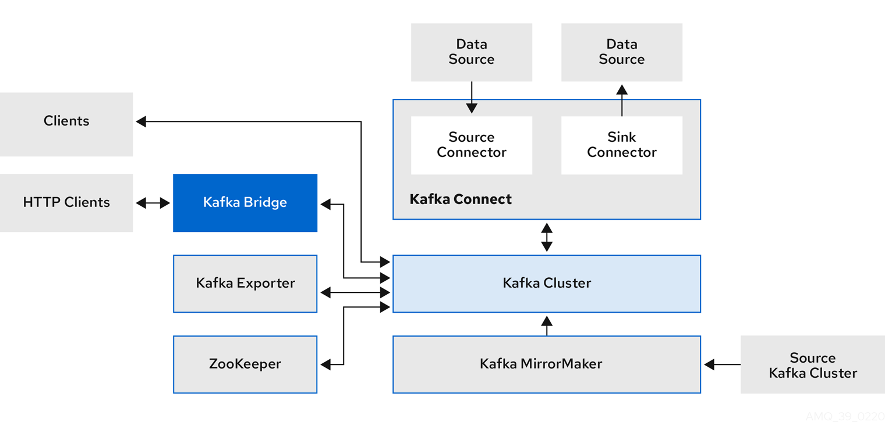

# Strimzi

[Strimzi](https://strimzi.io/) provides a way to run an Apache Kafka cluster on Kubernetes in various deployment configurations.

Secure by Default

* Built-in security
* `TLS`, `SCRAM-SHA`, and `OAuth` authentication
* Automated Certificate Management

Simple yet Configurable

* `NodePort`,` Load balancer` and `Ingress` options
* Rack awareness for HA
* Use dedicated nodes for Kafka

Kubernetes-Native Experience

* Use `kubectl` to manage Kafka
* Operator-based (What is an operator?)
* Manage Kafka using GitOps

## Components

A cluster of Kafka brokers handles delivery of messages.

A broker uses Apache ZooKeeper for storing configuration data and for cluster coordination. Before running Apache Kafka, an Apache ZooKeeper cluster has to be ready.

Each of the other Kafka **components** interact with the Kafka cluster to perform specific roles.



Data flows between several Kafka components and the Kafka cluster. See the component descriptions after this image.

### Apache ZooKeeper

Apache ZooKeeper is a core dependency for Kafka as it provides a cluster coordination service, storing and tracking the status of brokers and consumers. ZooKeeper is also used for controller election.

### Kafka Connect

Kafka Connect is an integration toolkit for streaming data between Kafka brokers and other systems using Connector plugins. Kafka Connect provides a framework for integrating Kafka with an external data source or target, such as a database, for import or export of data using connectors. Connectors are plugins that provide the connection configuration needed.

* A source connector pushes external data into Kafka.
* A sink connector extracts data out of Kafka
  External data is translated and transformed into the appropriate format.

You can deploy Kafka Connect with build configuration that automatically builds a container image with the connector plugins you require for your data connections.

### Kafka MirrorMaker

Kafka MirrorMaker replicates data between two Kafka clusters, within or across data centers.

MirrorMaker takes messages from a source Kafka cluster and writes them to a target Kafka cluster.

### Kafka Bridge

Kafka Bridge provides an API for integrating HTTP-based clients with a Kafka cluster.

### Kafka Exporter

Kafka Exporter extracts data for analysis as Prometheus metrics, primarily data relating to offsets, consumer groups, consumer lag and topics. Consumer lag is the delay between the last message written to a partition and the message currently being picked up from that partition by a consumer

## [Quick Start](https://strimzi.io/quickstarts/)

### Applying Strimzi installation file

Next we apply the Strimzi install files, including `ClusterRoles`, `ClusterRoleBindings` and some Custom Resource Definitions (`CRDs`). The CRDs define the schemas used for declarative management of the Kafka cluster, Kafka topics and users.

```bash
# Create kafkaa Namespace
kubectl create namespace kafka

# Install strimzi operator using latest release and default configuration
kubectl apply -f 'https://strimzi.io/install/latest?namespace=kafka' -n kafka

# Verify resources are installed and ready
kubectl get all -n kafka

# Explain kafka cluster CRDs
kubectl explain 'kafka.spec'
kubectl explain 'kafka.spec.kafka.version'
```

### Provision the Apache Kafka cluster

`Strimzi` needs a simple Custom Resource to create the resources, which will then give you a small *persistent Apache Kafka Cluster* with one node each for Apache Zookeeper and Apache Kafka:

```bash
# Apply the `Kafka` Cluster CR file
kubectl apply -f examples/kafka/kafka-persistent-single.yaml -n kafka 

# Wait while Kubernetes starts the required pods, services and so on:
kubectl wait kafka/my-cluster --for=condition=Ready --timeout=300s -n kafka 
```

### Test and list topics

```bash
# Get list of default topics
kubectl -n kafka run kafka-topics -ti --image=quay.io/strimzi/kafka:0.28.0-kafka-3.1.0 --rm=true --restart=Never -- bin/kafka-topics.sh --bootstrap-server my-cluster-kafka-bootstrap:9092 --list
```

### Send and receive messages

Once the cluster is running, you can run a simple producer to send messages to a Kafka topic (the topic will be automatically created):

```bash
kubectl -n kafka run kafka-producer -ti --image=quay.io/strimzi/kafka:0.28.0-kafka-3.1.0 --rm=true --restart=Never -- bin/kafka-console-producer.sh --bootstrap-server my-cluster-kafka-bootstrap:9092 --topic my-topic

# And to receive them in a different terminal you can run:

kubectl -n kafka run kafka-consumer -ti --image=quay.io/strimzi/kafka:0.28.0-kafka-3.1.0 --rm=true --restart=Never -- bin/kafka-console-consumer.sh --bootstrap-server my-cluster-kafka-bootstrap:9092 --topic my-topic --from-beginning
```
